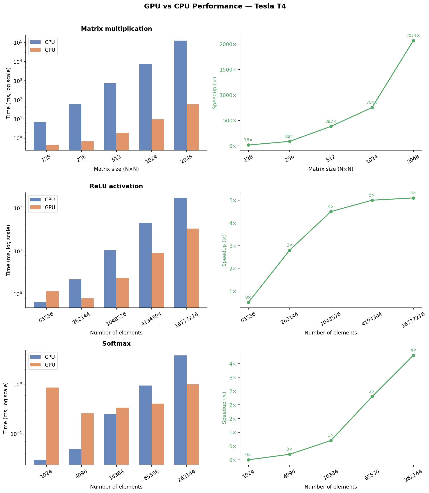

[](https://githubtocolab.com/BlissPhinehas/gpu-neural-net-accelerator/blob/main/notebook/gpu_accelerator.ipynb)
# GPU Neural Network Layer Accelerator

CUDA-accelerated matrix multiplication, ReLU, and Softmax benchmarked against CPU equivalents. Includes a Python ctypes wrapper to call CUDA kernels directly from Python and Matplotlib visualizations of performance gains.

**Hardware:** NVIDIA Tesla T4 · CUDA 12.8 · 5120 CUDA cores · 15.6GB VRAM

---

## Results

### Matrix Multiplication Speedup (CPU vs GPU)

| Matrix Size | CPU (ms) | GPU (ms) | Speedup |
|-------------|----------|----------|---------|
| 128×128     | 6.82     | 0.44     | 15.7×   |
| 256×256     | 59.22    | 0.68     | 87.5×   |
| 512×512     | 749.87   | 1.96     | 382.1×  |
| 1024×1024   | 7285.52  | 9.66     | 754.2×  |
| 2048×2048   | 125609.37| 60.66    | 2070.9× |

### ReLU Speedup

| Elements   | CPU (ms) | GPU (ms) | Speedup |
|------------|----------|----------|---------|
| 65,536     | 0.64     | 1.18     | 0.5×    |
| 262,144    | 2.20     | 0.80     | 2.8×    |
| 1,048,576  | 10.57    | 2.36     | 4.5×    |
| 4,194,304  | 45.22    | 8.98     | 5.0×    |
| 16,777,216 | 172.84   | 33.60    | 5.1×    |

### Softmax Speedup

| Elements | CPU (ms) | GPU (ms) | Speedup |
|----------|----------|----------|---------|
| 1,024    | 0.03     | 0.86     | 0.0×    |
| 4,096    | 0.05     | 0.26     | 0.2×    |
| 16,384   | 0.25     | 0.34     | 0.7×    |
| 65,536   | 0.94     | 0.41     | 2.3×    |
| 262,144  | 3.84     | 1.01     | 3.8×    |



---

## Project Structure

```
gpu-neural-net-accelerator/
├── src/
│   ├── ops.h           # shared header — all function declarations
│   ├── matmul.cu       # tiled shared memory matrix multiply kernel
│   ├── relu.cu         # parallel ReLU kernel
│   ├── softmax.cu      # 3-stage parallel reduction softmax kernel
│   └── cpu_ops.cpp     # CPU baselines for benchmarking
├── benchmarks/
│   └── benchmark.cu    # timing harness using CUDA events
├── python/
│   ├── gpu_ops.py      # ctypes wrapper — call CUDA kernels from Python
│   ├── test_gpu_ops.py # correctness tests — all 5 pass
│   └── benchmark_viz.py# Matplotlib performance charts
├── plots/
│   ├── performance.png       # generated charts
│   └── benchmark_results.txt # raw benchmark output
├── notebook/
│   └── gpu_accelerator.ipynb # Colab notebook — run instantly
└── CMakeLists.txt
```

---

## Key Concepts

**Tiled matrix multiply** — loads 16×16 chunks of input matrices into shared memory (100× faster than global GPU memory) before computing. This is how cuBLAS works internally.

**Parallel reduction** — softmax requires knowing the sum of all elements. Threads cooperate using shared memory to compute this in O(log N) steps instead of O(N).

**CUDA events timing** — all benchmarks use `cudaEventRecord` and `cudaEventElapsedTime` for accurate GPU-side timing, not CPU wall clock.

**ctypes bridge** — kernels are compiled into a shared `.so` library and called from Python using `ctypes` with no dependency on PyTorch or PyCUDA.

**Backward pass (backpropagation)** — CUDA kernels for the gradient of each operation. `matmul_backward` computes dA = dC·Bᵀ and dB = Aᵀ·dC using tiled shared memory. `relu_backward` passes gradients where input > 0 and blocks them elsewhere. `softmax_backward` computes the Jacobian-vector product in two parallel passes.

---

## Run It Yourself

### Option A — Google Colab (recommended, no setup needed)
Open `notebook/gpu_accelerator.ipynb` in Colab and run all cells.

### Option B — Linux with CUDA toolkit
```bash
git clone https://github.com/BlissPhinehas/gpu-neural-net-accelerator.git
cd gpu-neural-net-accelerator
mkdir build && cd build && cmake .. && make -j4
cd ..
./build/benchmark
python3 python/test_gpu_ops.py
python3 python/benchmark_viz.py
```